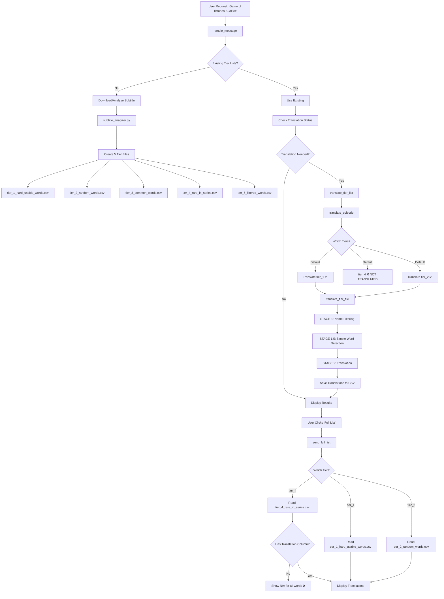
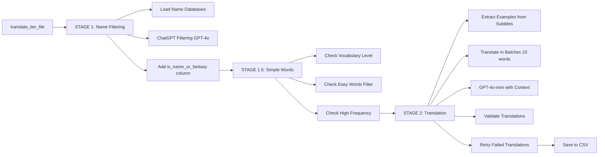

# Translation Pipeline - Complete Flow Diagram

## Overview

The translation pipeline has 4 main stages:
1. **Subtitle Analysis** → Creates tier lists
2. **Name/Fantasy Entity Filtering** → Flags names and simple words
3. **Translation** → Translates words with context
4. **Display** → Shows results to user

## Complete Pipeline Flow



## Translation Pipeline Details

### Stage 1: Subtitle Analysis
**Location:** `subtitle_analyzer.py`

**Input:** Subtitle file (.srt)
**Output:** 5 tier CSV files

**Process:**
1. Parse subtitle → Extract words
2. Count frequencies (series + English)
3. Load vocabulary levels (A1-C2)
4. Categorize into tiers:
   - **Tier 1**: Low English freq, High series freq (best for learning)
   - **Tier 2**: Low English freq, Low series freq (rare words)
   - **Tier 3**: High English freq, High series freq (common words)
   - **Tier 4**: High English freq, Low series freq (common but rare in series) ⚠️
   - **Tier 5**: Filtered words (Oxford 3000, simple words)

### Stage 2: Translation Process

**Location:** `translate_words.py` → `translate_episode()`

**Current Behavior:**
- ✅ Translates `tier_1_hard_usable_words.csv`
- ✅ Translates `tier_2_random_words.csv`
- ❌ **Does NOT translate `tier_4_rare_in_series.csv`**
- ❌ Does NOT translate tier_3 or tier_5

**Translation Steps (for tier_1 and tier_2):**



### Stage 3: Display Results

**Functions:**
- `send_tier_list_results()` → Shows tier_1 (with translation check ✅)
- `send_rare_hard_words()` → Shows tier_2 (with translation check ✅)
- `send_full_list()` → Shows tier_1/tier_2/tier_4 (❌ NO translation check for tier_4)

## Problem: tier_4 Translation Failure

### Root Cause

**tier_4_rare_in_series.csv is never translated:**

1. **Default Translation Pipeline:**
   - `translate_episode()` only translates tier_1 and tier_2
   - tier_4 is completely skipped

2. **Display Function:**
   - `send_full_list()` can display tier_4
   - But has NO translation check/trigger
   - Just reads the file and shows "N/A" if no translations

3. **Result:**
   - tier_4 files have no `translation` column
   - All words show "N/A" when displayed

### Code Evidence

**translate_episode() - lines 1220-1248:**
```python
# Translate both tier 1 and tier 2
tier_1_file = episode_dir / "tier_1_hard_usable_words.csv"
tier_2_file = episode_dir / "tier_2_random_words.csv"
# ❌ tier_4 is NOT included
```

**send_full_list() - lines 3067-3089:**
```python
# Read tier list
words_data = []
with open(tier_file, 'r', encoding='utf-8') as f:
    reader = csv.DictReader(f)
    for row in reader:
        words_data.append(row)
# ❌ NO translation check before reading
# ❌ NO translation trigger
```

## Solution

Add translation check and trigger to `send_full_list()` for tier_4, matching the logic in `send_tier_list_results()` and `send_rare_hard_words()`.

This will:
1. Detect when tier_4 needs translation
2. Automatically trigger translation
3. Show "⏳ Translating words..." message
4. Retry failed translations
