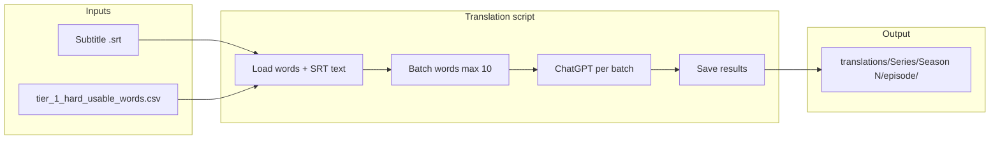

# 2. Translation System (Tier 1 → Russian)

This document describes the translation system for **tier-1 (hard usable)** words: dictionary-like **Russian** translations using episode subtitle context, via **ChatGPT**, in **batches of up to 10 words**.

---

## Purpose

- **Input**: Subtitle file and the word list from `tier_1_hard_usable_words.csv`.
- **Output**: A translations directory per episode with `tier_1_translations.csv` (and optional metadata).
- **Style**: Short, meaning-preserving, **contextual** to the episode; target language **Russian**; **maximum 4–5 words** per translation.

The system fits after the [word-tier pipeline](3_WORD_TIER_SYSTEM.md): tier lists are produced under `Tier_lists/`, then this step adds Russian translations for tier-1 words. Subtitle layout is as in [download_subtitles.py](../download_subtitles.py): `Subtitle/{series_name}/Season {N}/{filename}.srt`.

---

## Architecture



---

## Inputs

| Input | Description |
|-------|-------------|
| **Subtitle file** | Path to the episode SRT (e.g. `Subtitle/Game of Thrones/Season 2/game_of_thrones_s2_e2.srt`). Can be passed explicitly or inferred from `episode_info.json` in the episode directory. |
| **Word list** | From `tier_1_hard_usable_words.csv` (first column = `word`). |
| **Episode directory** | Optional. If provided (e.g. `Tier_lists/Game of Thrones/Season 2/2`), series name, season number, episode number and subtitle filename can be read from `episode_info.json` and the subtitle path resolved relative to `Subtitle/{series}/Season {N}/`. |

---

## Output

- **Directory**: `translations/{series_name}/Season {season_number}/{episode_number}/`  
  Same structure as tier lists (e.g. `translations/Game of Thrones/Season 2/2/`).

- **Files**:
  - **`tier_1_translations.csv`** — columns: `word`, `translation_ru` (and optionally `example`).
  - **`translation_info.json`** (optional) — metadata: series, season, episode, source_subtitle, translated_at.

---

## Translation rules

- **Short**: Prefer one word when it accurately conveys the meaning; otherwise a short phrase.
- **Meaning**: Preserve the meaning used in the episode.
- **Context**: Use the episode subtitle context to choose the right sense (e.g. noun vs verb, domain).
- **Russian**: All translations in Russian.
- **Length**: Maximum 4–5 words per translation.

---

## Batching

- Words are sent to ChatGPT in **batches of up to 10 words** per request to balance context size and API rate limits.

---

## CLI usage

The translation script is run with an episode directory (and optionally an explicit subtitle path):

```bash
# Use episode dir; subtitle path is inferred from episode_info.json relative to Subtitle/
python3 translate_tier_translations.py --episode-dir "Tier_lists/Game of Thrones/Season 2/2"

# Explicit subtitle path (overrides inference)
python3 translate_tier_translations.py --episode-dir "Tier_lists/Game of Thrones/Season 2/2" --subtitle "Subtitle/Game of Thrones/Season 2/game_of_thrones_s2_e2.srt"
```

**Environment**: Set `OPENAI_API_KEY` or pass `--openai-api-key` if the script supports it.

---

## Relationship to other components

- **Word-tier system**: [docs/3_WORD_TIER_SYSTEM.md](3_WORD_TIER_SYSTEM.md) — produces tier lists and `tier_1_hard_usable_words.csv`.
- **Subtitle paths**: [download_subtitles.py](../download_subtitles.py) — defines `Subtitle/{series_name}/Season {N}/` and naming.
- **Translations path**: Same series/season/episode layout as `get_tierlist_episode_dir` in [download_subtitles.py](../download_subtitles.py), under a `translations/` base directory.
